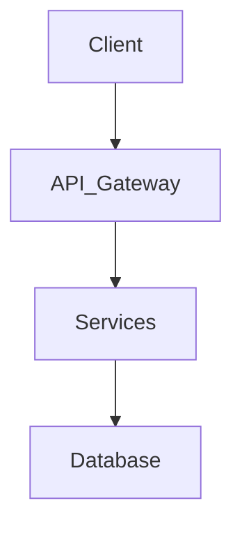

# System Design

## 1. High-Level Architecture
[描述系统的总体分层架构图与模块分工]

```mermaid
graph TD
    Client --> API_Gateway
    API_Gateway --> Services
    Services --> Database
```

## 2. Core Modules & Responsibilities
- **Module A:** 
- **Module B:** 

## 3. Data Flow
[关键业务流程的数据流转顺序说明]
